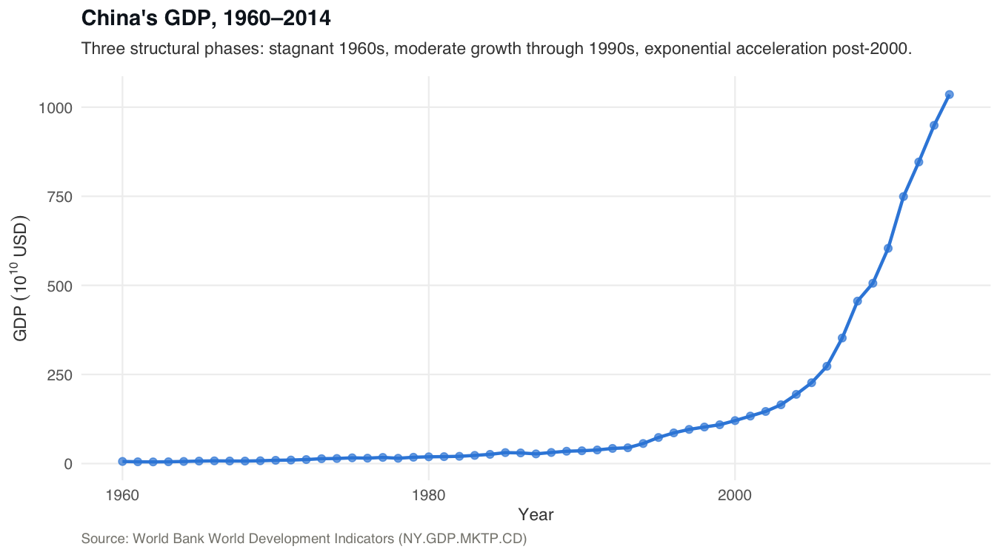
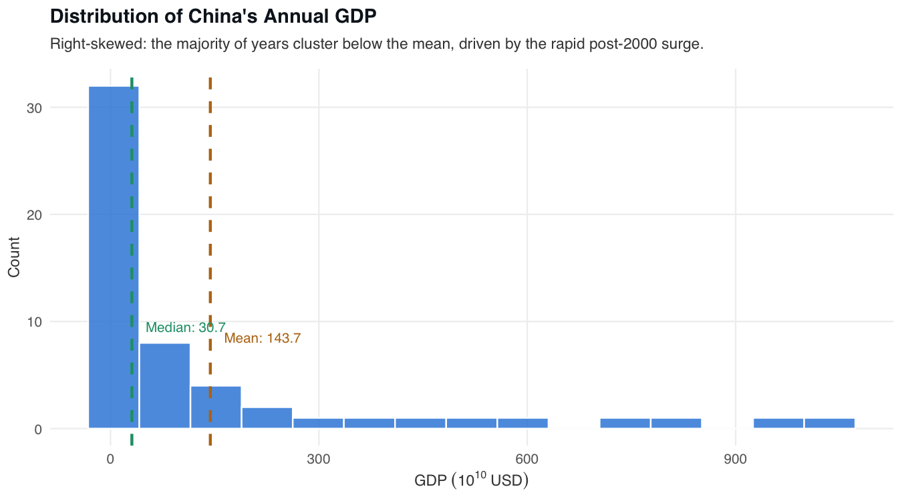
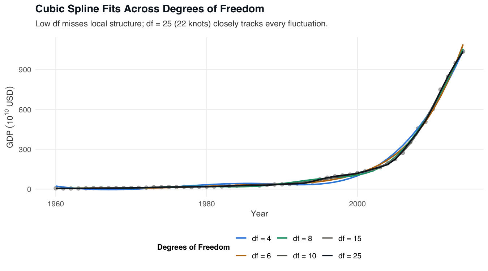
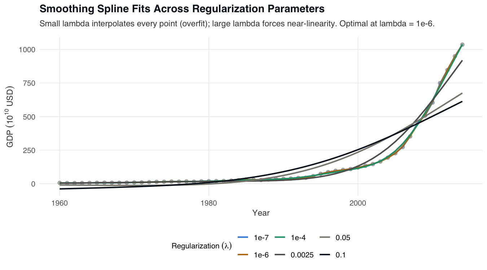
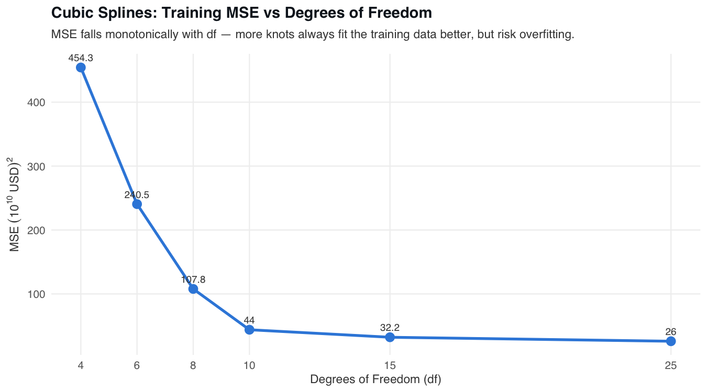
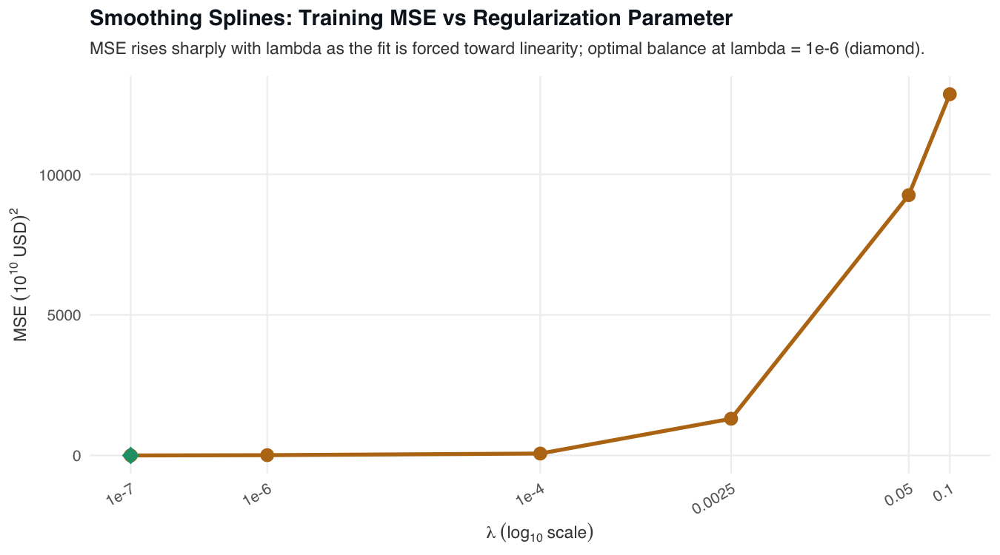

# 📌 China's GDP Growth Modeling

> Comparing cubic splines and penalized smoothing splines for modeling China's three-phase GDP trajectory (1960–2014) using 55 World Bank observations.

## 📖 Overview
 - Fits non-parametric regression models to China's annual GDP (1960–2014), a dataset with three structurally distinct growth phases that standard linear regression cannot capture.
 - Implements and compares two spline families: standard cubic splines via B-spline basis (`bs()`) across six degrees-of-freedom configurations, and penalized smoothing splines via `smooth.spline()` across six regularization parameters.
 - Developed as a graduate assignment for STATS 790 (Statistical Learning) at McMaster University, Winter 2022, and subsequently refactored into a reproducible R Markdown notebook with publication-quality figures.
 - GDP values are pre-scaled to units of 10¹⁰ USD to prevent near-singular basis matrices in high-knot-count B-spline fits — a necessary numerical conditioning step given the raw values spanning multiple orders of magnitude.

## 🏢 Business Impact
Analysts and economists frequently encounter economic time series with regime changes or structural breaks that no single parametric form can describe. This project demonstrates how to rigorously select spline complexity — through degrees-of-freedom tuning for cubic splines and the λ penalty for smoothing splines — and provides a reproducible, documented template for applying non-parametric curve fitting to macroeconomic data. The side-by-side comparison of both methods, complete with MSE tables and bias-variance trade-off plots, equips practitioners to make principled model-selection decisions rather than relying on ad hoc knot placement.

## 🚀 Features
✅ **Cubic Spline Sweep:** Six B-spline fits (df = 4 to 25) quantify how knot count controls the bias-variance trade-off, with MSE reported for each configuration.  
✅ **Smoothing Spline Sweep:** Six penalized fits (λ = 10⁻⁷ to 0.1) show continuous complexity control from near-interpolation to near-linearity, with effective degrees of freedom tracked alongside MSE.  
✅ **Method Comparison:** Head-to-head MSE comparison demonstrates that smoothing splines outperform cubic splines at their respective optima by ~56% (MSE 11.46 vs 25.99).  
✅ **Reproducible R Markdown Notebook:** Full analysis in `analysis.Rmd` with inline code, narrative, and `set.seed(42)` throughout — renders to a self-contained HTML report with a floating table of contents.  
✅ **Publication-Quality Figures:** Six `ggplot2` figures saved at 150 dpi covering the GDP time series, distribution, all spline fits, and MSE-vs-complexity curves for both methods.  
✅ **Structured Results Artefacts:** `results/metrics.md` stores the complete MSE tables for both spline families in a format suitable for direct reference or downstream reporting.  

## ⚙️ Tech Stack
| Technology                  | Purpose                                                                 |
| --------------------------- | ----------------------------------------------------------------------- |
| `R`                         | Primary analysis language for statistical modeling and visualization    |
| `splines`                   | B-spline basis construction (`bs()`) and smoothing spline fitting (`smooth.spline()`) |
| `tidyverse`                 | Data loading (`readr`), manipulation (`dplyr`, `tidyr`), and visualization (`ggplot2`) |
| `rmarkdown`                 | Renders `analysis.Rmd` to a self-contained HTML report                  |
| `renv`                      | Locks package versions for cross-machine reproducibility                |

## 📂 Project Structure
<pre>
📦 China's GDP Growth Modeling
 ┣ 📂 data
 ┃ ┗ 📂 raw
 ┃   ┣ 📜 gdpChina.csv
 ┃   ┣ 📜 gdpChina2.csv
 ┃   ┗ 📜 README.md
 ┣ 📂 figures
 ┃ ┣ 📜 01_gdp-time-series.png
 ┃ ┣ 📜 02_gdp-distribution.png
 ┃ ┣ 📜 03_cubic-splines-fits.png
 ┃ ┣ 📜 04_smoothing-splines-fits.png
 ┃ ┣ 📜 05_cubic-mse-vs-dof.png
 ┃ ┗ 📜 06_smoothing-mse-vs-lambda.png
 ┣ 📂 results
 ┃ ┗ 📜 metrics.md
 ┣ 📜 analysis.Rmd
 ┣ 📜 LICENSE
 ┗ 📜 README.md
</pre>

> **Why two sets of CSV files?** `gdpChina.csv` and `gdpChina2.csv` appear both at the project root (original assignment working directory) and under `data/raw/` (refactored layout). The analysis reads from `data/raw/gdpChina2.csv`; the root copies are retained for reference.

## 🛠️ Installation

1️⃣ **Clone the repository**
<pre>
git clone https://github.com/real-ahmed-moussa/cgdpgm.git
cd cgdpgm
</pre>

2️⃣ **Install R dependencies**
<pre>
# From an R console:
install.packages("renv")
renv::restore()
</pre>

3️⃣ **Render the full analysis notebook**
<pre>
# From an R console in the project root:
rmarkdown::render("analysis.Rmd")
</pre>

4️⃣ **Regenerate figures only (optional)**
<pre>
Rscript generate_figures.R
</pre>

## 📂 Figures

### GDP Time Series (1960–2014)

  

### GDP Distribution

  

### Cubic Spline Fits

  

### Smoothing Spline Fits

  

### Cubic Splines: MSE vs Degrees of Freedom

  

### Smoothing Splines: MSE vs λ

  

## 📊 Results
 - **Task:** Non-parametric regression on 55 annual observations of China's GDP (1960–2014) to model a three-phase non-linear growth trajectory.
 - **Best cubic spline:** df = 25 (22 interior knots) achieves training MSE = 25.99, improving 17× over the simplest configuration (df = 4, MSE = 454.26).
 - **Best smoothing spline:** λ = 10⁻⁶ (effective df ≈ 31.1) achieves training MSE = 11.46, selected by the GCV criterion as the optimal bias-variance balance.
 - **Method comparison:** Smoothing splines outperform cubic splines at their respective optima by ~56% (MSE 11.46 vs 25.99), with the added advantage of automatic knot placement and conservative linear boundary extrapolation.
 - **Bias-variance insight:** Both methods clearly illustrate the trade-off — high complexity (low λ or high df) overfits year-to-year noise; low complexity (high λ or low df) misses the structural breaks at the 1970s recovery and 2000s acceleration.

## 📝 License
This project is shared for portfolio purposes only and may not be used for commercial purposes without permission.
